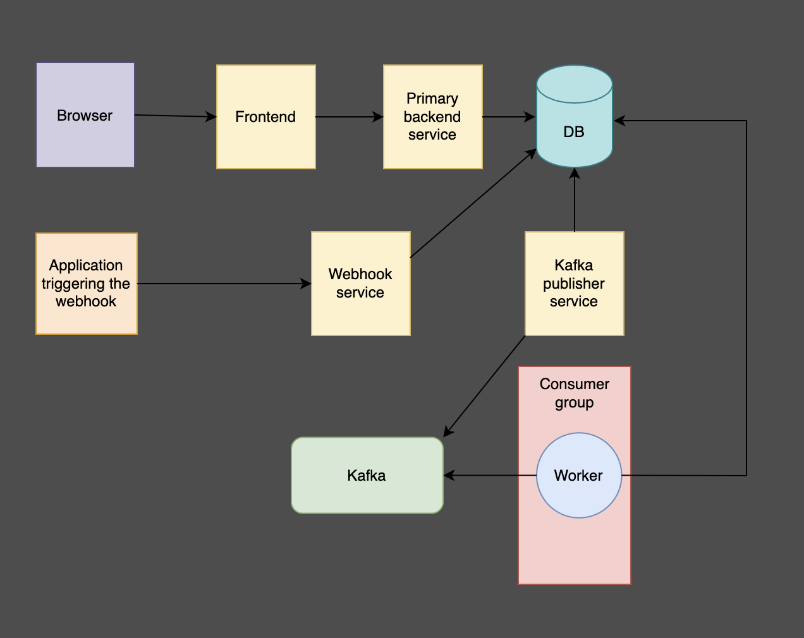
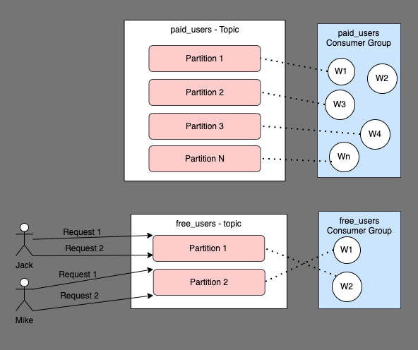
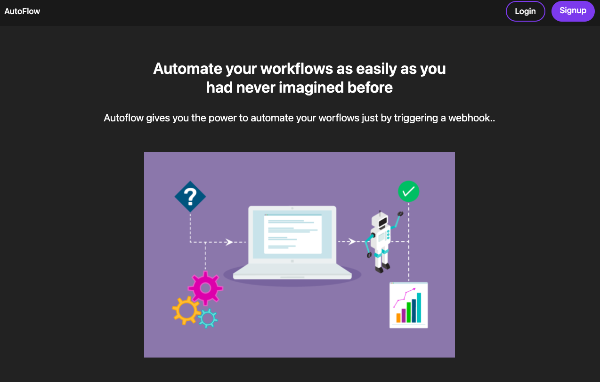
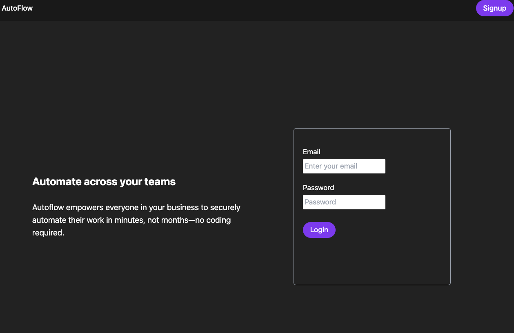
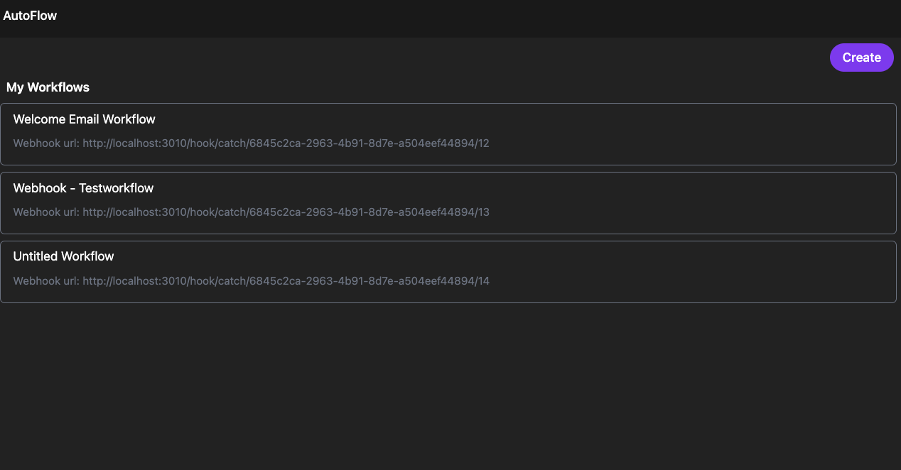
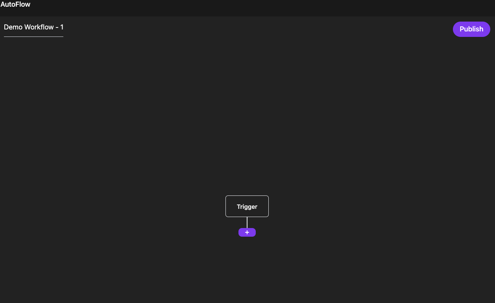
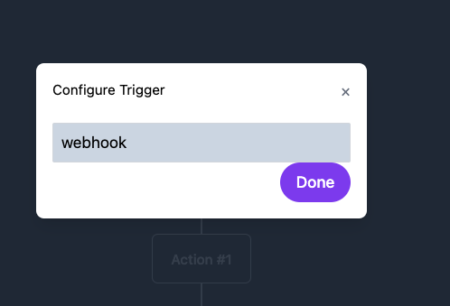
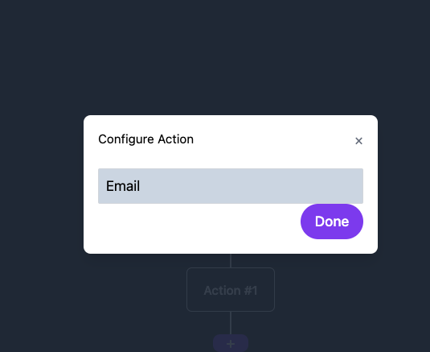
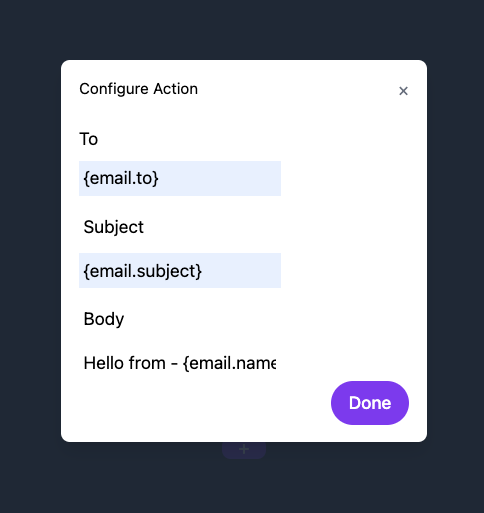

# Autoflow - Workflow Automation Tool

This project is a workflow automation tool that creates a trigger and performs a set of actions when the trigger is invoked.

## Supported Triggers

- Webhook

## Supported Actions

- Email

## Tools and Technologies

- Node.js
- React.js
- Webhooks
- Prisma
- Resend.js (for sending emails)
- Kafka.js
- JWT
- Bcrypt
- Neon DB
- React Hook Form
- Express.js
- PostgreSQL

## High-Level Architecture

This system follows an event-driven architecture. Below is an overview of all the parts in the high-level architecture:

### Primary Backend Service

An HTTP API service responsible for user registration, authentication, and workflow creation logic.

### Webhook Service

An HTTP service that, when triggered with the correct URL, creates entries in the `workflowrun` and `workflowrunout` tables. This pattern is called the transactional outbox pattern, used to ensure that both database entry and Kafka messaging occur without discrepancies.

### Kafka Publisher Service

An infinitely running service that pulls records from the `workflowrunoutbox` table, pushes the `run_id` as a message to Kafka, and deletes the records from the table.

### Worker Service

An infinitely running service that runs a Kafka consumer, listening for messages in Kafka. When a message is received (after being put into Kafka by the publisher service), it processes the message and performs the associated workflow actions, such as sending an email.

## Why Kafka over Redis Queue for this Use Case

- **ACK Mechanism**: Kafka has an inbuilt mechanism for acknowledging the completion of message processing using the `commitOffset` method.
- **Fault Tolerance**: If the worker is down, unprocessed messages are not lost and will be picked up from the latest point when the consumers are back up.
- **Load Balancing**: Kafka provides inbuilt load balancing of workers by assigning requests using a round-robin method.

## Potential Architecture of Kafka for Scaling with Kubernetes

There can be two topics in Kafka: `free_users` and `paid_users`. Two consumer groups responsible for these topics will be managed as follows:

- **Consumer Group for Free Users**: This can be lightweight with a minimal number of workers. Email of a user can be hashed and sent to the same partition to ensure balanced load across partitions. Rate limiting can be enabled to prevent queue clogging.

- **Consumer Group for Paid Users**: This can be a Kubernetes pod with Horizontal Pod Autoscaling (HPA) enabled, scaling based on the number of requests and CPU usage. More replicas of workers can be deployed to ensure a better user experience for paid users.

Some screenshots of the app

## Learnings

- Transactional Outbox Pattern
- Kafka
- Email Templating

---

This document provides a comprehensive overview of Autoflow's architecture and the technologies used.
